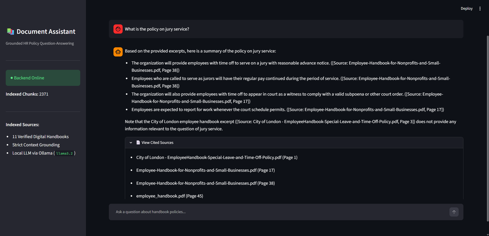

# 🏢 RAG-Powered Employee Handbook Assistant

Demo Video: [Watch the demo](https://drive.google.com/file/d/1l30sqc0a-4lPi6HjJwHKv_EOLtUW90-Z/view?usp=sharing)

An end-to-end, production-oriented Retrieval-Augmented Generation (RAG) web application designed to answer complex employee policy and HR inquiries. The system extracts verified information from an indexed corpus of digital employee handbooks, strictly enforces factual grounding to prevent hallucinations, and cites exact source documents and page numbers.

---

## 🏛️ System Architecture

```text
                   ┌──────────────────────────────┐
                   │   Streamlit Web Interface    │
                   │   (Chat History, Citations)  │
                   └──────────────┬───────────────┘
                                  │ HTTP REST API (/query)
                                  ▼
                   ┌──────────────────────────────┐
                   │   FastAPI Backend Service    │
                   │   (Lifespan Loading, CORS)   │
                   └───────┬──────────────┬───────┘
                           │              │
   Vector Search (Cosine)  │              │ Injected Context Prompt
                           ▼              ▼
       ┌──────────────────────┐        ┌──────────────────────┐
       │   ChromaDB (Local)   │        │   Ollama (llama3.2)  │
       │  (2,371 Chunks)      │        │  (Strict Grounding)  │
       └──────────────────────┘        └──────────────────────┘
```

---

## 💻 Tech Stack

- **Large Language Model:** Local Ollama (`llama3.2:latest`, 3B parameters)
- **Embedding Model:** `BAAI/bge-small-en-v1.5` (384-dimensional dense vectors via `sentence-transformers`)
- **Vector Database:** ChromaDB (Persistent client with HNSW cosine similarity index)
- **Backend Service:** FastAPI with Pydantic v2 schemas and Uvicorn server
- **Frontend UI:** Streamlit with session state chat history
- **Document Processing:** PyPDF & LangChain Recursive Character Text Splitter

---

## 📂 Project Structure

```text
rag-assistant-project/
├── data/
│   └── raw_documents/         # 11 Verified digital PDF employee handbooks
├── notebooks/
│   └── rag_pipeline.ipynb     # Pipeline development, chunking, and evaluation report
├── backend/
│   ├── app/
│   │   ├── api/routes/query.py # GET /health, POST /query endpoints
│   │   ├── core/config.py     # Pydantic BaseSettings and environment loading
│   │   ├── schemas/query.py   # QueryRequest & QueryResponse models
│   │   ├── services/          # Modular retrieval and generation logic
│   │   ├── utils/             # Centralized logging configuration
│   │   └── main.py            # FastAPI entry point with lifespan index loader
│   ├── data/vector_store/     # Persisted ChromaDB index (2,371 chunks)
│   ├── tests/test_query.py    # Pytest automated test suite (3 passing tests)
│   ├── Dockerfile             # Production container definition
│   ├── requirements.txt       # Frozen backend dependencies
│   └── .env.example           # Backend environment template
├── frontend/
│   ├── app.py                 # Streamlit chat interface
│   ├── api_client.py          # HTTP service client
│   ├── requirements.txt       # Frontend dependencies
│   └── .env.example           # Frontend environment template
├── .gitignore
└── README.md
```

---

## 📄 Document Corpus & Ingestion

The assistant indexes **11 digital employee handbooks** spanning municipal guidelines, corporate standards, non-profit rules, and small business operations:

- **Total Chunks:** 2,371 chunks
- **Chunking Strategy:** Recursive character splitting (`chunk_size=600`, `chunk_overlap=100`) using hierarchical delimiters (`\n\n`, `\n`, `.`, ` `) to respect sentence and clause boundaries.
- **Traceability:** Every chunk preserves immutable metadata tracking `source` (filename) and `page` index.

---

## 🚀 Quickstart & Setup Guide

### 1. Prerequisites

- Python 3.10+
- [Ollama](https://ollama.com/) installed and running locally
- Pull the generation model

```bash
ollama run llama3.2
```

### 2. Clone & Environment Configuration

```bash
git clone https://github.com/Ahmedgamalxlr8/rag-assistant-project.git
cd rag-assistant-project

# Create virtual environment
python -m venv .venv
# Windows:
.venv\Scripts\activate
# Linux/macOS:
source .venv/bin/activate

# Install dependencies
pip install -r backend/requirements.txt
pip install -r frontend/requirements.txt
```

### 3. Environment Variables

Create `.env` inside `backend/`:

```env
HOST=0.0.0.0
PORT=8000
OLLAMA_MODEL=llama3.2
EMBEDDING_MODEL=BAAI/bge-small-en-v1.5
TOP_K=4
COLLECTION_NAME=handbook_docs
```

Create `.env` inside `frontend/`:

```env
API_BASE_URL=http://localhost:8000
```

### 4. Running the Application

**Start the FastAPI Backend (Terminal 1):**

```bash
cd backend
uvicorn app.main:app --reload --port 8000
```

*API documentation and Swagger UI are available at `http://localhost:8000/docs`.*

**Start the Streamlit UI (Terminal 2):**

```bash
cd frontend
streamlit run app.py
```

*Access the chat interface in your browser at `http://localhost:8501`.*

---

## 🧪 Automated Testing

Run the test suite using `pytest`:

```bash
cd backend
pytest -v tests/test_query.py
```

*Test coverage verifies `GET /health` connectivity, `POST /query` end-to-end inference with citations, and `422 Unprocessable Entity` validation on invalid requests.*

---

## 📡 API Reference & cURL Example

### Endpoint: `POST /query`

**Request Headers:**

- `Content-Type: application/json`

**Sample Request:**

```bash
curl -X 'POST' \
  'http://localhost:8000/query' \
  -H 'accept: application/json' \
  -H 'Content-Type: application/json' \
  -d '{
  "question": "What is the policy on jury service and court summons?"
}'
```

**Sample Response (200 OK):**

```json
{
  "answer": "Based on the provided document excerpts, here is a summary of the policy on jury service:\n* The organization will provide employees with time off to serve on a jury, with reasonable advance notice. ([Source: Employee-Handbook-for-Nonprofits-and-Small-Businesses.pdf, Page 38])\n* Employees called to serve as jurors will have their regular pay continued during the period of service. ([Source: Employee-Handbook-for-Nonprofits-and-Small-Businesses.pdf, Page 38])",
  "sources": [
    "City of London  - EmployeeHandbook-Special-Leave-and-Time-Off-Policy.pdf (Page 1)",
    "Employee-Handbook-for-Nonprofits-and-Small-Businesses.pdf (Page 17)",
    "Employee-Handbook-for-Nonprofits-and-Small-Businesses.pdf (Page 38)",
    "employee_handbook.pdf (Page 45)"
  ]
}
```

---

## 📊 Evaluation & Quantitative Findings (RAG Triad)

The RAG pipeline was evaluated across 10 diverse test queries in `notebooks/rag_pipeline.ipynb`:

- **Context Relevance (Retriever):** Cosine distance metrics for relevant policy queries consistently scored below $0.28$, demonstrating tight semantic alignment across 11 source documents.

- **Groundedness / Faithfulness (Generator):** The prompt uses explicit `[Doc i]` formatting and negative constraints. Out-of-domain queries (e.g., *First-Class International Travel Reimbursements*) properly triggered refusal phrases (*"I don't have enough information to answer that"*) without hallucinating non-existent corporate benefits.

- **Answer Relevance:** Summaries strictly addressed user requests without drifting into extraneous text.

## 📸 Application Preview



